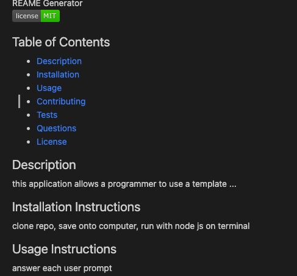
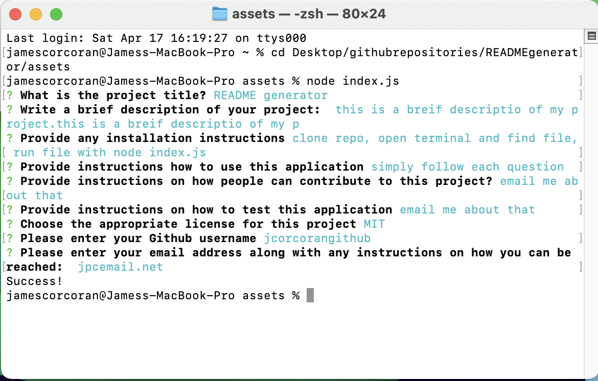

README Generator
  
## Description
The goal of this project is to create an application that accepts user input via the console and with the input generates a readme file. The information obtained conissts of the following: Description, Table of Contents, Installation, Usage, License, Contributing, Tests, and Questions. This application takes the input and allocates it appropriately throughout a template readme. This readem is the generated for the user.

link to github repo:
https://github.com/jcorcorangithub/READMEgenerator

link to video
https://drive.google.com/file/d/1O9mxY3C-T6yQImHiAMHsXN9y9A9VFw3S/view

## Technologies
JavaScript
Node Inquirer
Node fs

## Contributors
I will be the sole contributor of this project 

## Contact
Name: James Corcoran 
email: jpcsoccer1234@gmail.com

